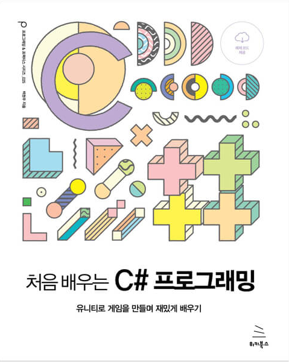
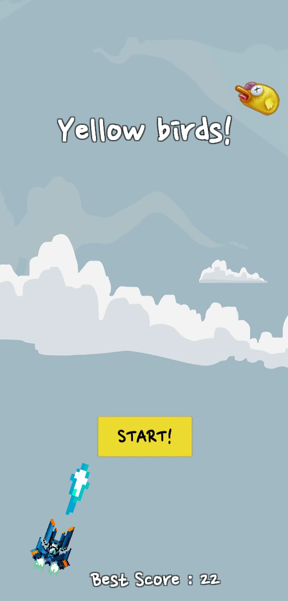
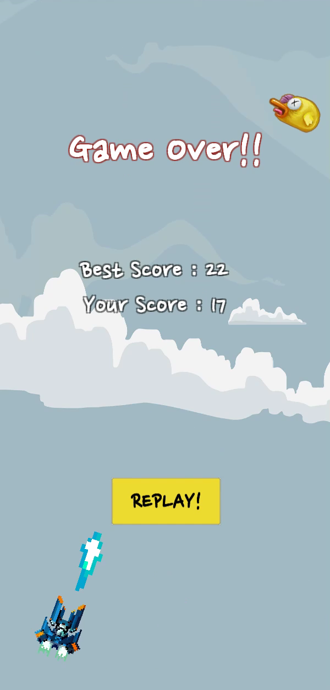

# Yellow Birds
> Unity와 C#을 이용하여 슈팅 게임 만들기

## 목표
</img> 
[처음 배우는 C# 프로그래밍](https://wikibook.co.kr/csharp-unity/)을 참고하여 Unity와 C#의 기초를 다지고, 슈팅게임을 완성하는 것을 목표로 한다.

## 기능
* 방향키(W,A,S,D)를 이용한 플레이어 조작과 스페이스바를 이용하여 총알 발사
* 적(노란새) 피격시 Score +1
* 노란 코인 획득시 Score +2
* 파란 코인 획득시 플레이어 스피드 업
* 적(노란새)과 충돌 시 플레이어 체력 -10
* 플레이어의 체력이 0이 되면 Game Over
* 플레이어의 Best Score 저장

## 완성화면
* **Game Play**  
</img> 
* **Game Start** & **Game Over**  
</img> </img> 

## 개발 환경
* 이 프로젝트는 **Unity 2019.4**를 기준으로 개발되었습니다.

## 사용 에셋
[2D Sprites pack](https://assetstore.unity.com/packages/essentials/asset-packs/2d-sprites-pack-73728)

## 문의
이메일 – algoribi36@gmail.com 
블로그 – https://algoribi.tistory.com/
